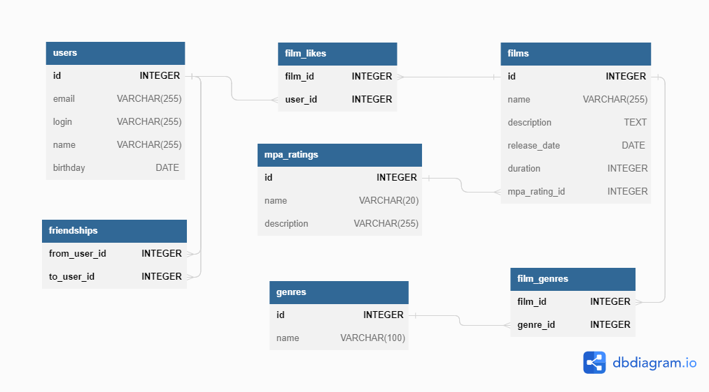

# Filmorate
Filmorate - бэкэнд-решение системы рейтинга кинофильмов.

## База данных

Структура (SQL)[schema.sql](src/main/resources/schema.sql)

### ER-диаграма


### Первоначальное заполнение данными справочников

```SQL
INSERT INTO mpa_ratings (mpa_rating_id, name, description) 
VALUES (1, 'G', 'у фильма нет возрастных ограничений'),
       (2, 'PG', 'детям рекомендуется смотреть фильм с родителями'),
       (3, 'PG-13', 'детям до 13 лет просмотр не желателен'),
       (4, 'R', 'лицам до 17 лет просматривать фильм можно только в присутствии взрослого'),
       (5, 'NC-17', 'лицам до 18 лет просмотр запрещён')
ON CONFLICT DO NOTHING;
```

```SQL
INSERT INTO genres (genre_id, name) 
VALUES (1, 'Комедия'),
       (2, 'Драма'),
       (3, 'Мультфильм'),
       (4, 'Триллер'),
       (5, 'Документальный'),
       (6, 'Боевик'),
       (7, 'Фантастика')
ON CONFLICT DO NOTHING;
```

### Примеры запросов

<h2>Операции с фильмами:</h2>

<b>Создание фильма:</b>

```SQL
INSERT INTO films (name,
                   description,
                   release_date,
                   duration,
                   mpa_rating_id)
VALUES ('Форрест Гамп', 
'Сидя на автобусной остановке, Форрест Гамп — не очень умный, но добрый и открытый парень — рассказывает случайным встречным историю своей необыкновенной жизни.
С самого малолетства парень страдал от заболевания ног, соседские мальчишки дразнили его, но в один прекрасный день Форрест открыл в себе невероятные способности к бегу. Подруга детства Дженни всегда его поддерживала и защищала, но вскоре дороги их разошлись...', 
'1994-06-23', 142, 3);
```

```SQL
INSERT INTO films (name,
                   description,
                   release_date,
                   duration,
                   mpa_rating_id)
VALUES ('Вызов', 
'Торакальный хирург Женя за месяц должна подготовиться к космическому полету, чтобы отправиться на МКС и спасти заболевшего космонавта. Ей придётся преодолеть неуверенность и страхи, а также провести сложнейшую операцию в условиях невесомости, от которой зависят шансы космонавта вернуться на Землю живым.', 
'2023-04-20', 164, null);
```

*mpa_rating_id=null, поскольку этому российскому фильму не присваивался рейтинг MPA

<b>Получение всех записей о фильмах (включая данные о рейтинге MPA и жанрах):</b>

```SQL
SELECT f.film_id,
       f.name,
       f.description,
       f.release_date,
       f.duration,
       STRING_AGG(DISTINCT m.name, ', ') AS mpa_rating,
       STRING_AGG(DISTINCT g.name, ', ') AS genres
FROM films f
         LEFT JOIN mpa_ratings m ON f.mpa_rating_id = m.mpa_rating_id
         LEFT JOIN film_genres fg ON f.film_id = fg.film_id
         LEFT JOIN genres g ON fg.genre_id = g.genre_id
GROUP BY f.film_id;
```

<b>Получение записи о фильме:</b>

```SQL
SELECT f.film_id,
       f.name,
       f.description,
       f.release_date,
       f.duration,
       STRING_AGG(DISTINCT m.name, ', ') AS mpa_rating,
       STRING_AGG(DISTINCT g.name, ', ') AS genres
FROM films f
         LEFT JOIN mpa_ratings m ON f.mpa_rating_id = m.mpa_rating_id
         LEFT JOIN film_genres fg ON f.film_id = fg.film_id
         LEFT JOIN genres g ON fg.genre_id = g.genre_id
WHERE f.film_id=1		 
GROUP BY f.film_id;
```

<b>Добавление лайка фильму</b>

```SQL
INSERT INTO film_likes (film_id,user_id) VALUES (1,1)
```

<b>Добавление сведений о жанре фильма

```SQL
INSERT INTO film_genres (film_id, genre_id) VALUES (1,1), (1,2)
```

<b>Получение записей популярных фильмов (с ограничением количества - 9):</b>

```SQL
SELECT f.name AS name, COUNT(l.user_id) as likes
FROM films AS f
INNER JOIN film_likes AS l ON l.film_id=f.film_id
GROUP BY f.film_id
ORDER BY COUNT(l.user_id) DESC
LIMIT 9;
```

<h2>Операции с пользователями</h2>

<b>Добавление записи о пользователе</b>

```SQL
INSERT INTO users (email, login, name, birthday)  
VALUES ('ivanovii5432@yandex.ru', 
        'ivanovii5432', 
        'Иванов Иван Иванович', 
        '1978-01-12')
```

<b>Получение списка всех пользователе</b>

```SQL
SELECT * FROM users;
```

<b>Получение записи конкретного пользователя (id=1)</b>

```SQL
SELECT * FROM users WHERE id=1;
```

<b>Добавление запроса на дружбу с пользователем (from_user_id = 1, to_user_id = 2)</b>

```SQL
INSERT INTO friendships (from_user_id, to_user_id) VALUES  (1,2)
```

<b>Подтверждение статуса дружбы (from_user_id = 1, to_user_id = 2)</b>

```SQL
UPDATE friendships SET is_confirmed=TRUE WHERE from_user_id=1 AND to_user_id=2
```

<b>Получение списка друзей пользователя (user_id = 1)</b>

```SQL
SELECT users.* FROM users
JOIN friendships as f ON users.user_id=f.from_user_id AND f.to_user_id=1
WHERE is_confirmed=TRUE
UNION
SELECT users.* FROM users
JOIN friendships as f ON users.user_id=f.to_user_id AND f.from_user_id=1
WHERE is_confirmed=TRUE
```